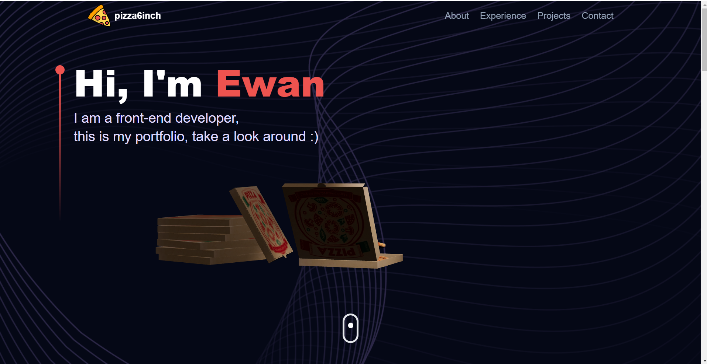

# my_Portfolio

This is my personal portfolio website showcasing my projects, skills, and experiences as a web developer. The site is built using modern web technologies like Three.js for 3D models, React for dynamic components, and various motion animations to create an interactive experience.

Take a look! -> [](https://my-portfolio-kappa-six-33.vercel.app/)

- [Quick Start!](#quick-start)
- [Technologies](#technologies)
- [Show case](#showcase)

## Quick Start!

To set up the project locally, follow these steps:

1. **Clone the repository and install dependencies:**

```
git clone https://github.com/pizza6inch/my_Portfolio.git
cd /my_portfolio
npm install
```

2. **Sign up for an [EmailJS](https://www.emailjs.com/) account**
3. **Create an email service and email template on EmailJS.**
4. **Set up environment variables in a .env file:**

```py
VITE_APP_EMAILJS_SERVICE_ID = <service_qwer1234> # replace it with your service ID
VITE_APP_EMAILJS_TEMPLATE_ID = <template_qwer1234> # replace it with your template ID
VITE_APP_EMAILJS_PUBLIC_KEY = <myPublicKey> # replace it with your public key
```

5. **start the app & open [localhost](http://localhost:5173)**

```
npm run dev
```

## Technologies

- **Vite**, **React**, **TypeScript** – Core web framework and language.
- **TailwindCSS** – For responsive and utility-first CSS.
- **Three.js** + **React-three-fiber** – To render 3D models.
- **Framer Motion** – For smooth animations.
- **React Tilt** – Adds tilt effects to elements.
- **EmailJS** – Handles email form submissions.

## Showcase



The portfolio includes:

- **3D interactive models** built with Three.js.
- **Smooth animations** and transitions using Framer Motion.
- **Contact form** integrated with EmailJS for easy communication.

## Credits

- UI design inspired by [adrianhajdin/project_3D_developer_portfolio](https://github.com/adrianhajdin/project_3D_developer_portfolio), I studied its approach and then independently built my own version using **TypeScript** and **add the feature of switching to Chinese version.**
